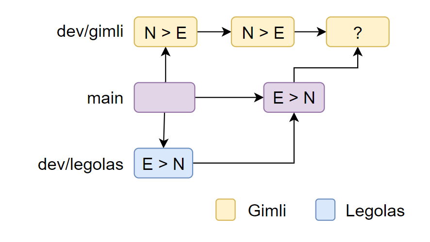
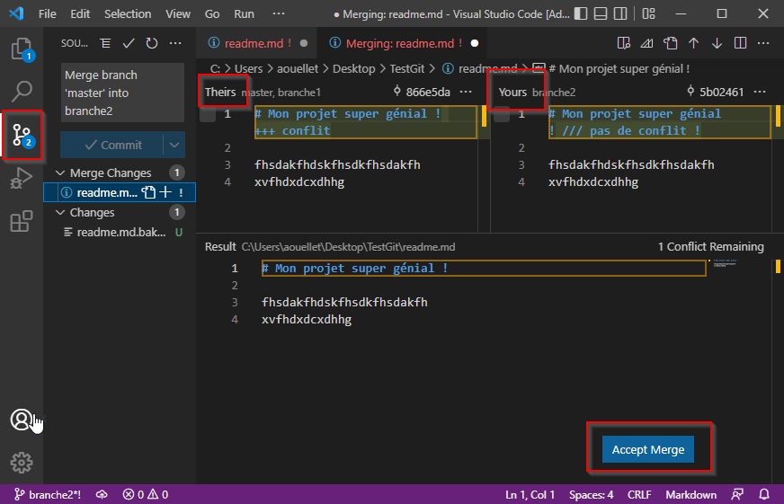
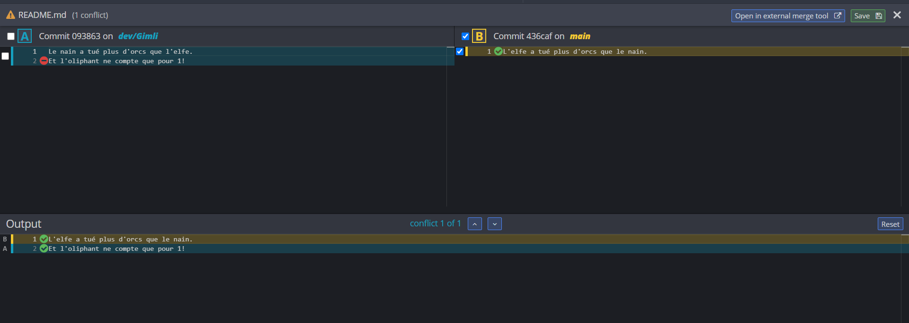

<style>
  section {
    font-family: 'Trebuchet ms', serif !important;
    height: 720px;
    width: 1280px;
    padding: 70px 80px 70px 80px;
    font-size: 20pt;
  }
  h1 {
    margin : 0.5em 0 1em 0;
    color: #780006;
    font-size : 40pt;
    position: absolute;
    top: 70px;
  }
  p, h2 {
    color: #333
  }
  section::after {
    content: attr(data-marpit-pagination) ' / ' attr(data-marpit-pagination-total);
    color : #000;
    bottom: -2px;
    left: 20px;
  }
  img[alt~="center"] {
    display: block;
    margin: 20px auto;
  }
  blockquote {
    border-left: 8px solid #333; 
    border-right: 8px solid #333;
    text-align: center; 
  }
</style>

<!-- _paginate: false -->

# GIT

## Qu'est-ce que Git ?

C'est un système de contrôle de version distribué libre et public.

## Pourquoi gittons-nous ?
- Gérer les différentes versions d'un même système
- Faciliter la publication d'outils libres
- Permettre à chaque développeur de travailler indépendamment sur leur version du système 

---

## Serveur et clients Git
Généralement, un serveur est utilisé pour permettre aux utilisateurs de partager leurs versions du système.

Le serveur est partagé par tous les intervenants au projet.
Principaux service de serveurs Git :

- Git Hub
- Git Hub Classroom
- Bitbucket (Atlassian)
- GitLab

Chaque intervenant doit avoir le logiciel Git installer et peut le manipuler par le biais d'un client (interface humain - logiciel).

Les principaux clients sont :
- Git Bash (console)
- Git Kraken (GUI - indépendant)
- Git Hub Desktop (GUI - Git Hub)
- Source Tree (GUI - Atlassian)
- SmartGit (GUI - indépendant)

Chaque intervenant peut avoir un client différent.

---

## Installer Git
1. Télécharger Git
  [https://git-scm.com/](https://git-scm.com/)
2. [Optionnel] Installer un client ou utiliser Git Bash
3. Créer un compte sur le site web d'un serveur Git

---

## Le dépôt local

Un __dépôt__ git (_repo_) représente un projet dont le versionnage est géré par Git.

```console
git init
```

--- 

## Manipuler le dépôt local

Chaque version du système est appelée __commit__. Chaque commit est identifié de façon unique par un __hash__ généré automatiquement.

Avant de créer un commit on doit sélectionner quel fichier inclure dans le commit.
Pour connaître l'ensemble des fichiers modifiés depuis le dernier commit :

```console
git status
```

Pour ajouter un ou plusieurs fichiers manuellement :

```console
git add <fichier1> [<fichier2> ...]
```
Pour ajouter tous les fichiers créés, modifiés ou supprimés depuis le dernier commit :

```console
git add --all
```

Une fois ajoutés, les fichiers passent dans l'état _staged_. Tous les fichiers _staged_ seront inclus dans le prochain commit dans l'état où ils seront lors du commit.

Chaque commit doit être accompagné d'une description significative.
```console
git commit -m <"Message">
```

---

## À l'aide, j'ai fait une erreur dans mon commit !

Ça arrive. La solution la plus simple et celle à mettre en oeuvre 99% du temps est de modifier le projet et refaire un nouveau commit.

Il existe une façon de modifier le dernier commit, nous y reviendrons plus tard.

---

## Retourner sur la dernière version stable

Vous avez fait des changements qui incluent plein de bogues et vous souhaitez repartir du point où ça fonctionnait. La commande __reset__ permet de revenir dans l'état du dernier commit et détruire les changements faits depuis le commit.

```console
git reset --hard
```

---

## Lier le local et le distant

Le serveur distant présente une copie centralisée du dépôt. La mise à jour entre le dépôt local et le dépôt distance se fait de façon manuelle.

Pour copier la version distante sur le local, on utilise la commande __fetch__.
```console
git fetch
```

On a alors 2 copies du même dépôt, l'une représentant le local (identifiée par _main_), l'autre représentant le distant (identifiée par _origin/main_).

On va devoir fusionner l'information du distant avec celle du local. On parle alors de __merge__.

```console
git merge <nom-branche>
```

---

## Du 2 en 1

Le _fetch_ suivi d'un _merge_ avec le distant est une opération très fréquente dans Git. Alors, les développeurs ont introduit une instruction qui exécute d'abord un _fetch_ puis un _merge_ : le __pull__.

```
git pull
```

---

## Publier sur le dépôt distant
Avant de publier sur le dépôt distant, il faut indiquer lier la branche du main local avec le main distant. Le distant porte (par convention) le nom origin.

```console
git set remote add origin <nom-du-repo>
```

L'opération de publication s'appelle __push__. Un _push_ copie la version locale vers le serveur distant. Seuls les changements dans un commit sont copiés.

Le distant ne fait pas de _merge_, donc le local doit inclure la dernière version du distant
(aka : toujours _pull_ avant de _push_).

```console
git push
```

---

## Le premier push

Lors du premier _push_, git ne sait pas comment faire correspondre le local et le distant. Il faut alors le lui indiquer.

Cette opération est nécessaire que lors du le premier _push_.

```console
git push --set-upstream origin <nom-branche>
```

_Si vous utilisez un client GUI, il n'y a généralement pas de différence entre le premier push et les autres._

Maintenant vos collaborateurs ont accès à vos modifications !

---

## Le distant en premier

Si un dépôt distant existe déjà et que vous voulez en faire une copie pour travailler en local (après tout, une seule personne par équipe crée le projet Git), il faut utiliser la commande suivante.

```console
git clone <nom-distant>
```

Il vous sera demandé alors de vous identifier. L'identification diffère selon le client et le serveur distant utilisé.

---

## Récapitulatif

<center>

|Opération|Commande|
|---|---|
|Initialiser|git init|
|Cloner un distant sur ma machine|git clone|
|Ajouter une modification|git add|
|Faire un _commit_|git commit|
|Récupérer la version du distant|git pull|
|Publier une version vers le distant|git push|

</center>

---

## Il était une fois les branches

Imaginons que 2 programmeurs, Gimli et Legolas, travaillent sur le même projet et que les 2 utilisent la branche _main_.


Legolas maintenant publie un bogue dans son premier push.


---


---

## Isoler les modifications

Il serait intéressant d'avoir des versions parallèles en cours de développement et une version stable qui inclut les fonctionnalités __terminées et testées__.

Une __branche__ permet de gérer des versions parallèles. À chaque branche il sera associé un rôle. 

Pour lister les branches du dépôt.

```console
git branch
```

---

## Créer une branche

Pour ajouter une branche sur le depôt local :

```console
git branch <nom-branche>
```

Le nom des branches doit être composé de caractères alphanumériques, ne pas commencer par -, ne pas contenir de .. et ne pas terminer par /

La création d'une branche copie l'état actuel de la branche et nous déplace sur la nouvelle branche.

Chaque branche possède un pointeur de tête HEAD qui nous permet de se positionner.

---

## Propagation des changements


  
---


---

## Se promener de branches en branches

Pour changer de branche, on utilise la commande __checkout__.

```console
git checkout <nom-branche>
```

Attention, on ne peut pas changer de branche s'il y a des changements qui ne sont pas _commités_. Si cela arrive, il y a trois options :
- Faire un commit
- Effacer les changements (_git reset --hard_)
- Utiliser la stash (vous irez lire là-dessus)

---

## Fusionner des branches

Pour amener les modifications faites à une branche sur une autre branche (ex. fusionner les versions de deux équipiers), on effectue un __merge__.

```console
git merge <nom-branche>
```

---

## Quand créer une branche ?

Chaque branche répond à un besoin particulier. Ces besoins sont : 
- Versionnage du système (version développement, stable, publiée (_dev, main, release_))
- Correction d'erreurs mineures (_hotfix_)
- Développement de nouvelles fonctionnalités (_features/..._)

#### Projet scolaire

Pour un projet scolaire, vous devriez minimalement avoir une branche principale (que vous gardez propre) et une branche par personne pour vos fonctionnalités (qui elle sera moins propre...).

---

## Les conflits

Dans le fichier readme.md de leur dépôt git, Legolas inscrit "L'elfe a tué plus d'orques que le nain". En même temps (fort de sa propre version), Gimli inscrit "Le nain a tué plus d'orques que l'elfe".

Legolas publie en premier ses modifications, donc Gimli doit d'abord récupérer les modifications de Legolas avant de pouvoir _merger_ sa branche locale.



---

## Quand un conflit se produit-il ?

Un conflit se produit lorsqu'un emplacement dans un fichier a été modifié sur deux branches différentes. À la fusion des branches, Git ne peut pas déterminer quelle est la bonne version.

La résolution de conflit consiste alors à indiquer à Git quelle sera la bonne version à conserver.

Il est impossible de procéder au _merge_ tant que tous les conflits ne sont pas réglés.

---

## Apprendre à résoudre ses conflits

Sans outil externe de résolution de conflit, 3 options s'offrent à nous pour résoudre les conflits :

1. Forcer Git à prendre TOUTES les modifications de la branche en cours 
(notre version _--ours_)
2. Forcer Git à conserver TOUTES les modifications de la branche fusionnée 
(leur version _--theirs_)
3. Résoudre manuellement chaque endroit ou un conflit se produit

Évidemment, la troisième option sera celle à utiliser le plus souvent

---

## Identification des conflits

Les conflits seront marqués de la façon suivante dans le fichier impliqué.

```console
<<<<<<< HEAD:file.txt
Version locale du fichier
=======
Version distante du fichier
>>>>>>> hash du commit mergé:file.txt
```

Concrètement, Gimli voit ceci :

```console
<<<<<<< HEAD:readme.md
Le nain a tué plus d'orques que l'elfe (Ce que Gimli a écrit)
=======
L'elfe a tué plus d'orques que le nain (Ce que Legolas a écrit et qui est sur le main)
>>>>>>> 77976da35a11db4580b80ae27e8d65caf5208086:readme.md
```

---

## Résolution du conflit

Sans logiciel de résolution de conflit, le merge avec la 3e option provoque un _commit_ sur la branche locale avec les marques de conflit. 

Gimli doit alors ouvrir chaque fichier et traiter les marques (c.-à-d. supprimer les caractères et l'une des deux versions).

Plusieurs IDE / Éditeur de texte supportent l'édition de conflit

---

## Résolution de conflit dans VSCode

<center>



</center>

---

## Git Kraken

Plusieurs clients GUI Git incluent un outil de résolution des conflits. Sinon certains logiciels spécialisés en résolution des conflits (P4Merge) peuvent être utilisés.



---

## Ignorez-moi SVP

Certains fichiers ne devraient pas être partagés, car chaque utilisateur doit en avoir une version différente ou tout simplement ils ne sont pas pertinents à partager.

Type de fichiers à ne pas partager :  
 
- Fichiers de configuration de projet : .sln, .gitignore, .idea...  
- Fichiers dérivés : /bin, /obj ...  

#### Pourquoi ?

Par exemple, un fichier de configuration contenant le chemin du projet ne devrait pas être partagé, car chaque utilisateur aura un chemin différent sur sa machine.

---

## Le .gitignore

Un fichier nommé ".gitignore" contient tous les fichiers et répertoires devant être ignorés par git.

Ignorer par Git signifie que la commande __git add --all__ n'inclut pas ces fichiers.

On peut placer plusieurs .gitignore dans notre projet. Chaque fichier est lu et les informations sont marquées pour être ignorées. 

Le .gitignore contient des informations par chemin relatif.

---

## Générer un gitignore

La plupart des clients inclut un outil pour générer automatiquement un .gitignore basé sur un modèle indiqué à la création du projet (ex. Visual Studio ou Unity...). 

Le modèle généré ignore les fichiers et dossiers standards du projet (pas vos personnalisations). Il doit être placé à la racine du projet. Tous les chemins sont relatifs au .gitignore.

Le site web [https://gitignore.io](https://gitignore.io) permet aussi de générer des modèles de git ignore.

---

## Un exemple de gitignore

```text
# Created by https://www.toptal.com/developers/gitignore/api/visualstudiocode
# Edit at https://www.toptal.com/developers/gitignore?templates=visualstudiocode
### VisualStudioCode ###
.vscode/*
!.vscode/settings.json
!.vscode/tasks.json
!.vscode/launch.json
!.vscode/extensions.json
*.code-workspace
# Local History for Visual Studio Code
.history/
...
```
https://www.toptal.com/developers/gitignore/api/visualstudiocode

---

## "Mon .gitignore est brisé, il ajoute des fichiers qui devraient être ignorés."

Votre .gitignore fonctionne très bien. Voici deux erreurs (code 12) férquentes avec le .gitignore :

- Erreur de chemin : les chemins sont relatifs au fichier .gitignore (et non au dépôt Git)  
- Erreur de _tracking_ : votre fichier a déjà été suivi par Git  

---

## Le tracking

Quand on ajoute pour la première fois un fichier à un dépôt git, Git commence à le suivre (__tracking__). Si un fichier est déjà suivi par Git, il continuera de le suivre même si un gitignore est ajouté et devrait empêcher ce fichier d'être inclut.

#### Pourquoi le tracking ?

Cela nous évite d'avoir à écrire une exception dans le .gitignore pour chaque fichier que nous voudrions suivre et qui tombe sous une règle du .gitignore.

---

## Enlever un fichier de l'index suivi
Pour dire à Git d'arrêter de suivre un fichier on utilise la commande suivante.

```console
git rm --cached <nom-fichier>
```

Attention, bien que le fichier demeure sur le local de votre machine, lors du prochain _pull_, les autres utilisateurs verront ce fichier être supprimé de leur machine.

Cette commande enlève tous les fichiers suivis.

```console
git rm -r --cached .
```

---

## Ajouter un .gitignore sur le tard

La séquence pour ajouter un .gitignore sur un projet qui est déjà créé est la suivante.

```
git rm -r --cached .
git add --all
git commit -m <"Message">
```

Et voilà, votre .gitignore fonctionne !

#### Effet de bord

Il s'agit quand même d'une solution agressive sur votre dépôt.

Si vous aviez besoin de suivre un fichier en particulier, vous devrez le rajouter, car le __git add --all__ ne le fera pas.

---

## Petits trucs avec Git

- Ce __n'est pas un gestionnaire de sauvegarde__. Un dépôt "planté" peut être très difficile à récupérer. Faites des sauvegardes.
- __Parlez-vous__ sur l'utilisation de git. Si une seule personne fait des branches, elle va trouver le temps long.
- __Commiter__ souvent, __merger__ rarement. Les _commits_ locaux ne coutent rien et vous permettent de revenir dans un état stable en cas d'ajout de code fautif.
- Utilisez git dès le __début__ du projet.
- Éviter d'utiliser l'option __--force__ surtout si vous ne savez pas ce que vous faites. Cela peut briser votre dépôt.
- Évitez les commandes __rebase__, __amend__ ou __squash__ si vous n'êtes pas sûr de ce que vous faites. 

---

## Aller plus loin

- GitFlow : structurer votre flux de travail
- Commandes : __rebase__, __amend__ ou __squash__. Puissantes, mais dangereuses dans certains contextes.
- Pull-request : demander une validation
- Git-secret : évite de partager certaines informations (comme un mot de passe de BD ou une clé pour les services Google)