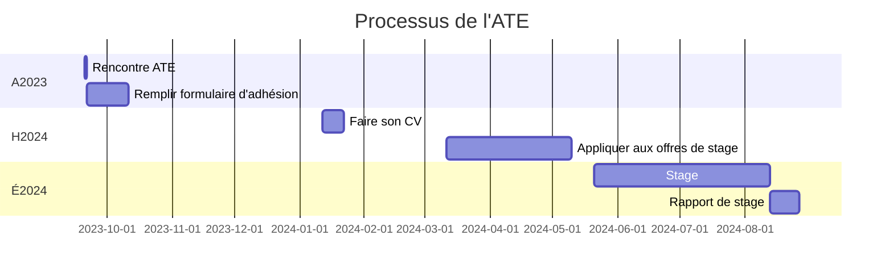

# Alternance travail études - Information pour l'élève

# Dates importantes

- Rencontre ATE - 2023-09-20
- Remplir formulaire d'adhésion - avant 2023-10-10
- Faire son CV - Entre 2024-01-12 et 2024-01-22
- Appliquer aux offres de stage - Entre 2024-03-11 et 2024-05-11
- Stage - Débute 2024-05-21 pour 10 à 12 semaines
- Rapport de stage - À la fin du stage

# Séquence ATE

|            | Automne          | Hiver            | Été                                                   |
| ---------- | ---------------- | ---------------- | ----------------------------------------------------- |
| 1ère année | Session d'études | Session d'études | Stage ATE niveau 1                                    |
| 2ème année | Session d'études | Session d'études | Stage ATE niveau 2                                    |
| 3ème année | Session d'études | Session d'études | Stage ATE niveau 3  Retour 45h (Projet personnel) |

# Conditions

- Études à temps plein
- Minimum 2 phases (études-stage) d’alternance, maximum 3
- En TI, les stages sont de 10 semaines
- Temps plein, semaines consécutives, sauf si l’entreprise ferme
- Stages = ajout au programme d’au moins 20 % du nombre d’heures prévues au programme (2518 h = 504 h) cummulé entre les deux stages

# Rémunération

- Loi sur les normes du travail pour les stages faits au Québec (CNESST)
- Loi de la province ou du pays pour les stages faits ailleurs
- Assurances de l’employeur

# Rôle et responsabilités

## Élève

- Signer ou renouveller le contrat d'adhésion
- Trouver son stage
- Faire son CV
- Faire le rapport de stage

## Le collège

- Présenter l'ATE en début de parcours
- Valider le statut de l'élève
- Visiter l'élève dans son milieu de stage
- Révision de ton CV  

# Contrat d'adhésion  

Voici le contrat d'adhésion à remplir avant le __10 octobre 2023__ :  [Contrat d'adhésion](https://forms.office.com/r/h4TifC6sRJ)  

# Préalables

## Niveau 1

Pour accéder au stage de niveau 1, tu dois avoir réussi tous tes cours de formation spécifique à la session 1, soit :

- 201-1A3-VI : Mathématiques de l'ordinateur
- 420-1B4-VI : Fonctionnement de l'ordinateur
- 420-1C4-VI : Outils informatiques
- 420-1D6-VI : Programmation 1
- 420-1E6-VI : Design Web

## Niveau 2

Pour accéder au stage de niveau 2, tu dois avoir réussi tous les cours préalables au stage de niveau 1, ainsi que les cours suivants :

- Au moins deux (2) cours de formation générale prévus dans la programmation institutionnelle ;
- Au moins dix (10) cours de formation spécifique prévus dans la programmation institutionnelle. Parmi ces cours, tu dois avoir réussi :

- 420-2A6-VI : Programmation 2 **ou**
- 420-3A5-VI : Développement Web 2

Il n’est pas nécessaire d’avoir effectué un stage de niveau 1 pour accéder au stage de niveau 2.

## Niveau 3

Accessible seulement après la 3e année.

- Avoir réussi tous les cours de formation spécifique des sessions 1 à 5 (ou leurs équivalents) prévus dans la programmation institutionnelle.
- Avoir réussi au moins huit (8) cours de formation générale prévus dans la programmation institutionnelle ;

Le stage de niveau 3 n’est pas contingenté.

Note : Il est nécessaire d’avoir effectué un stage de niveau 1 ou de niveau 2 pour accéder au stage de niveau 3.

Dates des stages: ± 22 mai 2024 au 31 juillet 2024 (10 semaines) – Limite 15 août 2024
Cours intensif - Projet personnel (45 h) ± 1 août au 12 août 2024

!!! Warning "Attention"
    Pour chacun des stages, malgré l’atteinte des préalables, le département se réserve le droit de suspendre la démarche de stage d’une étudiante, d’un étudiant, s’il juge que le savoir-être, l’assiduité en classe ou la participation aux activités en vue du stage, sont de nature à compromettre l’intégration en entreprise ou la réussite de son stage.

# Pourquoi des frais de 100$?  

__POUR CHAQUE STAGE__ :  

- L’API vérifie les préalables (admissibilité au stage ou non)
- Au service d’admission: facturation et suivi du paiement 
- Au département, préparation du stagiaire et du stage
- Réalisation du stage
- Colliger les pièces requises au dossier (5)
- Déclaration des heures  (Socrate) qui apparaîtront sur ton bulletin
- Émission de l’Attestation… par le service des stages -  Signature de la direction et envoi à l’employeur
- Intégration du dossier de l’étudiant dans Clara

# Pourquoi faire un stage?  

- Travailler dans ton domaine d’études
- Être encore plus investie, investi dans tes études
- Découvrir le rythme de l’entreprise
- Connaître 2 ou 3 entreprises, secteurs et tailles d'entreprises
- T’intégrer dans une équipe de travail
- Découvrir des facettes du rôle de programmeur
- Voir les possibilités d’avancement
- Découvrir ce que tu aimes, ce que tu aimes moins
- Un revenu
- De l’expérience (négociable)

# Pourquoi les employeurs offrent des stages?  

- Une nouvelle ressource (période définie) et la main-d’œuvre est rare
- Je l’observe… et je sais si j’aimerais le garder… ou non
- Je découvre son profil de travailleur (😀 ou 😱)
- Découvrir comment être un employeur attractif
- Préparer sa relève
- Un crédit d’impôt (24 % à 40 %) ou une subvention

# Élèves aux besoins particuliers  

Notre rôle est de te préparer aux stages.  Si tu as des inquiétudes par rapport aux séquences en entreprise, il faut en parler.  Stress, anxiété, questionnement, nous verrons comment te rassurer, te préparer à l’entrevue et à ton intégration dans ton milieu de stage. 

Si tu es déjà inscrit aux services adaptés, ce seront eux, en collaboration avec le service de placement et tes enseignants qui s’occuperont de ta préparation et de ton intégration en milieu de stage.

# Stages hors Québec  

Possibilité de stage à l’international :  

- Pays d’origine EN ATTENTE 
- Autres pays  EN ATTENTE
- Autres provinces (toutes et tous)  OUI!

!!! Warning "Attention"
    Les élèves venant de l'international ne sont pas éligibles aux subventions salariales du Gouvernement du Canada.  

# Qui contacter si vous avez d'autres questions?  

Contactez un de vos professeurs :  

- Étienne Rivard  
- François Mercier  
- Mathieu Fréchette  
- Simon Tousignant  